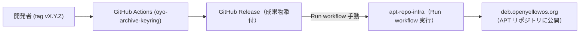

# oyo-archive-keyring

`oyo-archive-keyring` は、**open.Yellow.os の公式 APT リポジトリにアクセスするための GPG 公開鍵を配布する Debian パッケージ**です。  
APT がパッケージ署名を検証するために必須となるコンポーネントであり、GitHub Actions を利用して自動ビルド・リリースされています。

---

## リポジトリ構成

- `debian/` : Debian パッケージのメタデータ  
- `oyo-archive.gpg` : 公開鍵ファイル（必要に応じて更新）  
- `.github/workflows/release.yml` : CI/CD ワークフロー定義  

---

## クライアントPCからの取得方法

公式リポジトリからインストール可能です。

```bash
sudo apt update
sudo apt install oyo-archive-keyring
```

インストールすると `/usr/share/keyrings/oyo-archive.gpg` が配置され、  
`/etc/apt/sources.list.d/openyellowos.list` 内のリポジトリ設定で署名検証に使用されます。

---

## 使い方

通常はユーザーが直接操作することはありません。  
APT が自動的に公開鍵を利用してパッケージ署名を検証します。  

---

## 依存関係

- ランタイム依存関係は特にありません。  
- Debian パッケージ標準の仕組みに基づき、`/usr/share/keyrings/` 配下に GPG 鍵を配置します。  

---

## 仕組みと設定方法（管理者向け）

- 公開鍵 (`oyo-archive.gpg`) をシステムに導入し、APT の署名検証に利用します。  
- リポジトリ定義ファイル例:  

```text
deb [signed-by=/usr/share/keyrings/oyo-archive.gpg] http://deb.openyellowos.org trixie main
```

---

## CI/CD の仕組み（開発者向け）

`oyo-archive-keyring` は GitHub Actions により自動で `.deb` をビルド・リリースします。  
その後、[`apt-repo-infra`](https://github.com/openyellowos/apt-repo-infra) を **手動で Run workflow 実行** することで APT リポジトリに反映されます。  



---

### フロー概要

1. **ソースコード修正**
   ```bash
   git clone https://github.com/openyellowos/oyo-archive-keyring.git
   cd oyo-archive-keyring
   ```

2. **鍵の更新**
   ```bash
   gpg --armor --export <KEYID> > oyo-archive.gpg
   ```

3. **changelog 更新**
   ```bash
   debchange -i
   ```

4. **コミット & push**
   ```bash
   git add .
   git commit -m "Update GPG key"
   git push origin main
   ```

5. **タグ付与**
   ```bash
   git tag v1.0.1
   git push origin v1.0.1
   ```

6. **GitHub Actions による自動ビルド**
   - タグ push を検知してワークフローが起動  
   - `.deb` がビルドされ、GitHub Release に添付  

7. **APT リポジトリ公開**
   - `apt-repo-infra` の GitHub Actions を **手動で Run workflow**  
   - 入力例：  
     - Target environment: `production`  

---

## 開発環境に必要なパッケージ & ローカルでビルドする手順

### 必要なツール
```bash
sudo apt update
sudo apt install -y devscripts build-essential debhelper lintian
```

### deb-src を有効にする
1. `/etc/apt/sources.list` を編集
   ```bash
   sudo nano /etc/apt/sources.list
   ```
2. `deb-src` 行を有効化して保存
   ```text
   deb-src http://deb.debian.org/debian trixie main contrib non-free-firmware
   ```
3. 更新
   ```bash
   sudo apt update
   ```

### ビルド依存の導入
```bash
sudo apt-get build-dep -y ./
```

### ローカルビルド
```bash
dpkg-buildpackage -us -uc -b
```
生成物は `../oyo-archive-keyring_*_all.deb` に出力されます。

### テストインストール / アンインストール
```bash
sudo apt install ./../oyo-archive-keyring_*_all.deb
sudo apt remove oyo-archive-keyring
```

---

## バージョン管理ポリシー

- Semantic Versioning (`vX.Y.Z`) を採用  
- **staging / production** の環境を想定（現在は production のみ運用中）  

---

## ライセンス

MIT License  
© open.Yellow.os Project Team

---

## メンテナンス

- プロジェクト: [open.Yellow.os](https://openyellowos.org)  
- GitHub: [openyellowos/oyo-archive-keyring](https://github.com/openyellowos/oyo-archive-keyring)
