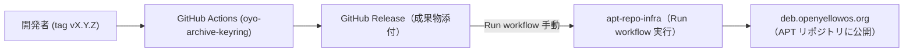

# oyo-archive-keyring

`oyo-archive-keyring` は、**open.Yellow.os の公式 APT リポジトリにアクセスするための GPG 公開鍵を配布する Debian パッケージ**です。  
APT がパッケージ署名を検証するために必須となるコンポーネントであり、GitHub Actions を利用して自動ビルド・リリースされています。

---

## リポジトリ構成

- `debian/` : Debian パッケージのメタデータ  
- `oyo-archive.gpg` : 公開鍵ファイル（必要に応じて更新）  
- `.github/workflows/release.yml` : CI/CD ワークフロー定義  

---

## CI/CD の仕組み

このリポジトリは GitHub Actions により、自動で `.deb` をビルド・リリースします。  
その後、[`apt-repo-infra`](https://github.com/openyellowos/apt-repo-infra) を **手動で Run workflow 実行** することで、APT リポジトリに反映されます。

### フロー

1. 開発者が新しいタグを push  
   ```bash
   git tag v1.0.0
   git push origin v1.0.0
   ```
2. GitHub Actions が `.deb` をビルド  
3. GitHub Release に成果物を添付  
4. 開発者が `apt-repo-infra` の `Run workflow` を実行  
5. `deb.openyellowos.org` に公開  

---

## 図解（Mermaid）



---

## 鍵の更新手順

新しい鍵を公開する場合は以下の手順を実行します。

1. GPG 鍵をエクスポート  
   ```bash
   gpg --armor --export <KEYID> > oyo-archive.gpg
   ```
2. `debian/changelog` を更新  
   ```bash
   dch -i
   ```
3. コミット & タグを push  
   ```bash
   git commit -am "Update GPG key"
   git tag v1.0.1
   git push origin main --tags
   ```

以降の処理は CI/CD により自動化され、`apt-repo-infra` を手動実行すれば公開されます。

---

## バージョン管理ポリシー

- Semantic Versioning (`vX.Y.Z`) を採用  
- **staging / production** の環境を想定（現在は production のみ運用中）  

---

## ローカルでのビルド（必要に応じて）

CI/CD による自動ビルドが基本ですが、手元で確認する場合は以下を実行します。

```bash
sudo apt-get install devscripts debhelper
debuild -us -uc
ls ../*.deb
```

---

## ライセンス

MIT License  
© open.Yellow.os Project Team

---

## メンテナンス

- プロジェクト: [open.Yellow.os](https://openyellowos.org)  
- GitHub: [openyellowos/oyo-archive-keyring](https://github.com/openyellowos/oyo-archive-keyring)
